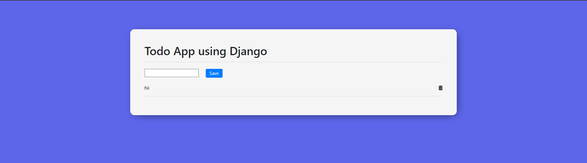
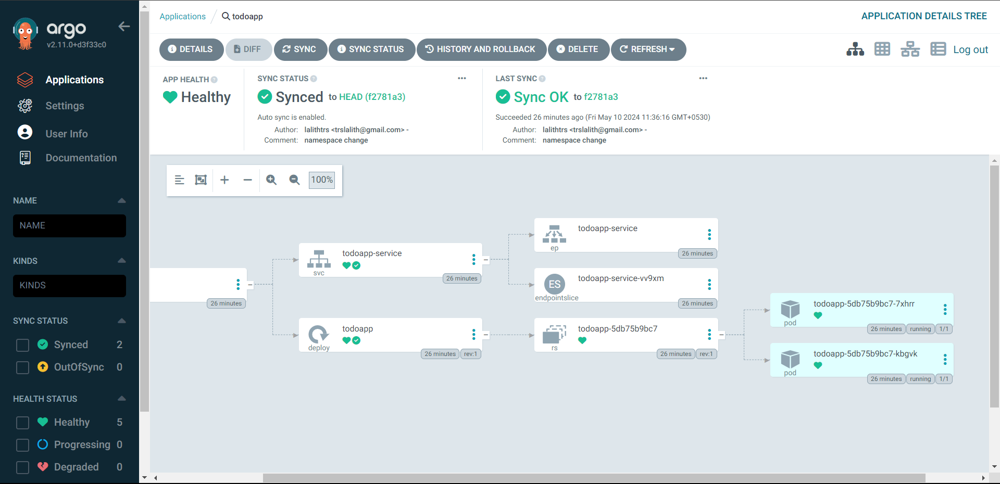

# To-Do app with Kubernetes and ArgoCD

In this repository, we will dockerize a simple web application, deploy it to a Kubernetes cluster using Argo
 CD, and manageits release process with Argo Rollouts. 

## Documentation
## Step 1:

* In this project, I have created a simple To-do list app with Django with sqlite3 as db.

* To run the application we have 2 options

    * Docker
    * Run in Local PC

## To Run the app
## Docker

Requirements

* Docker (https://docs.docker.com/get-docker/)

Docker Image

```bash
docker run lalithtrs/todo_app:1.1
```

(or) Create your own Docker image
```bash
docker build --tag todo_app:latest . # '.' represents current directory
docker images # to check whether the image is created or not
```
To run the container which we created

```bash
docker run --name todo_app -d -p8001:8000 todo_app:latest
docker ps # To see all the running containers

# name - image name
# -d - detach mode
# -p8000:8000 we are port forwarding the Docker container port(8000) to our host(PC) port(8001)
# Now we can access our application through http://localhost:8001
```
Push to Docker hub

Create an account in https://hub.docker.com/

Then Proceed with the following commands

```bash
docker login

docker tag todo_app:latest <Docker ID>/todo_app:latest

docker push <Docker ID>/todo_app:latest
```

Now you can access your docker image publically everywhere
## Local Machine 
Clone the project (Run locally)

```bash
  git clone https://github.com/lalithtrs/to-do-app.git
```

Go to the project directory

```bash
  cd to-do-app
```

Install dependencies

```bash
pip install -r requirements.txt
```

To initialize a local database
```bash
python manage.py makemigrations
python manage.py migrate
```

Run the app
```bash
python manage.py runserver
```


## Screenshots



This is the UI of the To-do App


## Step 2 (Kubernetes Cluster & ArgoCD Integration)

## Installing the minikube (Kubernetes Cluster Service)

Minikube is like a little playground for learning and trying out Kubernetes, which is a big tool used for running applications inside of containers. This have a default docker service which assists the kubernetes clusters.

Download the minikube from the official site https://minikube.sigs.k8s.io/docs/start/


After the installation
```Bash
minikube start # This will start a empty Kubernetes cluster
minikube status # For verifying the working of minikube
```
Access the Kubernetes Clusters using kubectl (CLI Tool for accessing Clusters).
This will be automatically installed with minikube.

```Bash
kubectl get pod # Smallest unit in the cluster 
kubectl get services # used to access the pod via request from Ingress
kubectl get deployment # This is used for the stateless apps
kubectl get replicaset # Used to view replicas of the pod
```


## Installing ArgoCD and ArgoCD Rollouts in Kubernetes

## ArgoCD

Argo CD is a GitOps continuous delivery (CD) tool. It uses Git, a popular version control system, to track and manage changes to your applications. When a change is made, Argo CD automatically deploys the updated application to Kubernetes.

Imagine Kubernetes as a big container ship, and Argo CD as a crane that carefully places shipping containers (applications) on the ship.It ensures your applications are always up-to-date and running smoothly, by automatically deploying them based on changes tracked in a simple system.

Follow the commandas to install ArgoCD in kubernetes

```
kubectl create namespace argocd
kubectl apply -n argocd -f https://raw.githubusercontent.com/argoproj/argo-cd/v2.11.0/manifests/install.yaml
```
This create a namespace called "ArgoCD". To access the ArgoCD

```
kubectl get pod -n argocd # n denotes the namespace
kubectl get svc -n argocd # To see the services(svc) running in behalf of the ArgoCD
```

To access the ArgoCD-server
```
kubectl port-forward -n argocd svc/argocd-server 8080:443
# This will port forward the argo-server to port:8000 
```
You will see a login page, the username is 'admin' and for password 
Go to terminal 
```
argocd admin initial-password -n argocd
# this auto-generate a hash , use base64 converter to decode it and enter into the login page , you will get access to the ArgoCD-Server
```
## ArgoCD Rollouts

Install ArgoCD Rollouts with this command
```
kubectl create namespace argo-rollouts
kubectl apply -n argo-rollouts -f https://github.com/argoproj/argo-rollouts/releases/latest/download/install.yaml
```
To see the argocd-rollouts namespace, type
```
kubectl get pod -n argocd-rollouts
```
To view the dashboard
```
kubectl argo rollouts dashboard
```

## Step 3

Creating an application in Kubernetes Cluster and monitor the change with ArgoCD Dashboard

Steps to Follow

* Create deployment.yaml file 
```
apiVersion: apps/v1 
kind: Deployment
metadata:
  name: todoapp # name of the app
spec:
  selector:
    matchLabels:
      app: todoapp
  replicas: 2 # no of pod replicas
  template:
    metadata:
      labels:
        app: todoapp
    spec:
      containers:
      - name: todoapp
        image: lalithtrs/todo_app:1.0 # Docker Image which we created eaarlier
        ports:
        - containerPort: 8000 # port of the django app
```

* Create service.yaml
```
apiVersion: v1
kind: Service
metadata:
  name: todoapp-service # name of the service
spec:
  selector:
    app: todoapp # app name
  ports:
  - port: 8001 # Our host port
    protocol: TCP
    targetPort: 8000 # container port
```
Move these two files (deployment.yaml and service.yaml) to seprate folder called /dev in the root directory of the project.

* Create rollout.yaml
```
apiVersion: argoproj.io/v1alpha1
kind: Rollout
metadata:
  name: todoapp
spec:
  replicas: 4
  strategy:
    canary:
      steps:
      - setWeight: 20
      - pause: {}
      - setWeight: 40
      - pause: {duration: 10}
      - setWeight: 60
      - pause: {duration: 10}
      - setWeight: 80
      - pause: {duration: 10}
  revisionHistoryLimit: 2
  selector:
    matchLabels:
      app: todoapp
  template:
    metadata:
      labels:
        app: todoapp
    spec:
      containers:
      - name: todoapp
        image: lalithtrs/todo_app:1.0
        ports:
        - containerPort: 8000
          protocol: TCP
```

Then create application.yaml
```
apiVersion: argoproj.io/v1alpha1
kind: Application
metadata:
  name: todoapp
  namespace: argocd 
spec:
  project: default
  source:
    repoURL:  https://github.com/lalithtrs/to-do-app.git # Actual state
    targetRevision: HEAD # Access to our recent commits, so that it can update our latest commit)
    path: dev # Path to deployment and service yaml files
  destination: 
    server: https://kubernetes.default.svc # Our own Kubernetes cluster, it can access the internal ip of the cluster.
    namespace: todoapp

  syncPolicy:
    syncOptions:
    - CreateNamespace=true # Check if the above namespace is already there or not, If not it will create a new namespace.

    automated:
      selfHeal: true (Change the app with the latest commit to the repository)
      prune: true # It will not allow to excecute the manual change in the cluster manifest.
```
Now push these files to the main repository. Then move to terminal and type

```
git push -u origin main

kubectl apply -f application.yaml 
kubectl apply -f rollout.yaml
# This will create a application in the argoCD and it starts to synchronize with github repository to the ArgoCD server.
```


After the ArgoCD-server synchronized, the Server will be like this. Like, we mentioned 

When you make a change in the Manifest files like updating the docker image version in the deployment file. The ArgoCD will look up for the changes in every 3 minutes. 

When it finds a out of sync change in the actual state (Git Repository) this will also change in the Cluster (Desired state)


So here, I have configured the docker version from 1.1 to 1.0 , So this was detected by the ArgoCD and the change was done. The Pods which are running in the docker version 1.1 is modified into verison 1.0

To see the rollout use the following command
```
kubectl rollouts get rollout todoapp --watch
```

Run the following command in the namespace that contains your Rollouts to see the dasboard
```
kubectl argo rollouts dashboard 
```

By this, we get to know about the Kubernetes and ArgoCD pipelines. 